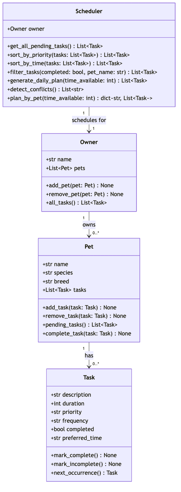

# PawPal+ (Module 2 Project)

You are building **PawPal+**, a Streamlit app that helps a pet owner plan care tasks for their pet.

## Scenario

A busy pet owner needs help staying consistent with pet care. They want an assistant that can:

- Track pet care tasks (walks, feeding, meds, enrichment, grooming, etc.)
- Consider constraints (time available, priority, owner preferences)
- Produce a daily plan and explain why it chose that plan

Your job is to design the system first (UML), then implement the logic in Python, then connect it to the Streamlit UI.

## What you will build

Your final app should:

- Let a user enter basic owner + pet info
- Let a user add/edit tasks (duration + priority at minimum)
- Generate a daily schedule/plan based on constraints and priorities
- Display the plan clearly (and ideally explain the reasoning)
- Include tests for the most important scheduling behaviors

## Getting started

### Setup

```bash
python -m venv .venv
source .venv/bin/activate  # Windows: .venv\Scripts\activate
pip install -r requirements.txt
```

### Suggested workflow

1. Read the scenario carefully and identify requirements and edge cases.
2. Draft a UML diagram (classes, attributes, methods, relationships).
3. Convert UML into Python class stubs (no logic yet).
4. Implement scheduling logic in small increments.
5. Add tests to verify key behaviors.
6. Connect your logic to the Streamlit UI in `app.py`.
7. Refine UML so it matches what you actually built.

## ✨ Features

- **Priority sorting** – `Scheduler.sort_by_priority()` orders tasks high → medium → low; unrecognized priority values sort last instead of erroring.
- **Chronological sorting** – `Scheduler.sort_by_time()` orders tasks by `preferred_time`, pushing untimed tasks to the end.
- **Filtering** – `Scheduler.filter_tasks(completed=..., pet_name=...)` narrows the task list by completion status, owning pet, or both.
- **Conflict warnings** – `Scheduler.detect_conflicts()` scans all pending tasks and flags any `preferred_time` shared by two or more tasks (same pet or different pets), so double-bookings surface before the day starts.
- **Daily recurrence** – `Pet.complete_task()` marks a task done and, for `"daily"`/`"weekly"` tasks, automatically schedules a fresh incomplete copy via `Task.next_occurrence()` — no manual re-entry needed.
- **Constrained daily planning** – `Scheduler.generate_daily_plan(time_available)` greedily fills a time budget in priority order, backfilling smaller lower-priority tasks into any leftover time; `Scheduler.plan_by_pet()` groups that same plan by pet for per-pet views.

## 🖥️ Sample Output

Output from running `python3 main.py`, which builds two pets with mixed times, priorities, and completion status, then walks through sorting, filtering, recurrence, conflict detection, and planning:

```
All tasks sorted by time
------------------------------
07:00  Litter box cleaning (5 min) [pending]
08:00  Morning walk (30 min) [done]
12:30  Vet checkup (20 min) [pending]
12:30  Playtime (15 min) [pending]
18:00  Feeding (10 min) [pending]

Pending tasks only (filter_tasks)
------------------------------
Feeding — high
Vet checkup — high
Playtime — low
Litter box cleaning — medium

Biscuit's tasks only (filter_tasks)
------------------------------
Feeding — high
Morning walk — high
Vet checkup — high

Completing Biscuit's Feeding task (recurs daily)
------------------------------
Feeding (daily) [done]
Morning walk (daily) [done]
Vet checkup (daily) [pending]
Feeding (daily) [pending]

Conflict check
------------------------------
⚠️  Conflict at 12:30: Biscuit's Vet checkup, Whiskers's Playtime

Today's Schedule
------------------------------

Biscuit:
  Vet checkup (20 min) [priority: high]
  Feeding (10 min) [priority: high]

Whiskers:
  Playtime (15 min) [priority: low]
  Litter box cleaning (5 min) [priority: medium]
```

## 🧪 Testing PawPal+

```bash
python -m pytest
```

The suite in `tests/test_pawpal.py` covers:

- **Sorting correctness** – tasks are returned in chronological order by `preferred_time`, untimed tasks sort last, and unknown priority values fall back to lowest priority without crashing.
- **Recurring tasks** – completing a `daily`/`weekly` task automatically schedules its next occurrence as a fresh, incomplete copy; non-recurring frequencies do not spawn a new task.
- **Conflict detection** – the `Scheduler` flags duplicate `preferred_time` slots across pets, within a single pet, and across 3+ tasks, while ignoring completed or untimed tasks.
- **Daily plan generation** – the greedy time-budget backfill respects the time available (including `0`/negative and exact-fit edge cases), prioritizes high-priority tasks first, and preserves stable ordering among equal-priority tasks.
- **Filtering and grouping** – `filter_tasks()` and `plan_by_pet()` behave correctly with unknown pet names and with duplicate (value-equal) tasks across different pets.

Sample test output:

```
============================= test session starts ==============================
platform darwin -- Python 3.14.3, pytest-9.0.3, pluggy-1.6.0
rootdir: /Users/nahomtesfay/ai110-module2show-pawpal-starter
plugins: anyio-4.13.0
collected 24 items

tests/test_pawpal.py ........................                            [100%]

============================== 24 passed in 0.01s ==============================
```

**Confidence Level:** ⭐⭐⭐⭐☆ (4/5)

All 24 tests pass, covering the core sorting, recurrence, and conflict-detection logic plus several edge cases (zero/negative time budgets, duplicate tasks, unknown priorities). I'm holding back a star because testing surfaced two behaviors worth revisiting before I'd call this production-ready: `sort_by_time` compares `preferred_time` as a raw string rather than a real time, so unpadded hours like `"9:00"` sort after `"10:00"`; and `complete_task()` has no guard against being called on an already-completed task, so it will spawn a duplicate recurring occurrence if triggered twice.

## 📐 Smarter Scheduling

| Feature | Method(s) | Notes |
|---------|-----------|-------|
| Task sorting | `Scheduler.sort_by_priority()`, `Scheduler.sort_by_time()` | Sorts tasks by priority (high → low) or by `preferred_time` (untimed tasks sorted last) |
| Filtering | `Scheduler.filter_tasks(completed=..., pet_name=...)` | Filters tasks across all pets by completion status, pet name, or both |
| Conflict handling | `Scheduler.detect_conflicts()` | Lightweight check: groups pending tasks by exact `preferred_time` and returns a warning message for any time slot shared by 2+ tasks, across the same or different pets. Does not check for overlapping durations (see `reflection.md` for that tradeoff) |
| Recurring tasks | `Task.next_occurrence()`, `Pet.complete_task()` | Completing a task via `Pet.complete_task()` marks it done and, if its `frequency` is `"daily"` or `"weekly"`, automatically appends a fresh incomplete copy for the next occurrence |
| Daily plan generation | `Scheduler.generate_daily_plan()`, `Scheduler.plan_by_pet()` | Builds a priority-ordered plan that backfills smaller lower-priority tasks into leftover time within a given time budget, and can group the result by pet |

## 📐 UML Diagram

Final class diagram, reflecting the actual `pawpal_system.py` implementation (source: [diagrams/uml_final.mmd](diagrams/uml_final.mmd)):



## 📸 Demo Walkthrough

### UI features

Running `streamlit run app.py` gives you a single-page app with three sections:

- **Owner & Pet** – enter an owner name, then add one or more pets (name + species). Pets appear in a running table as they're added.
- **Tasks** – pick which pet a task belongs to, then set its title, duration, priority, and an optional preferred time (`HH:MM`). Added tasks appear in a table **sorted by preferred time** (via `Scheduler.sort_by_time()`), with untimed tasks last. Below the table, the app calls `Scheduler.detect_conflicts()` and shows either a green success banner ("No scheduling conflicts detected") or a yellow warning per conflicting time slot.
- **Build Schedule** – set the total minutes available today and click "Generate schedule." The app calls `Scheduler.generate_daily_plan()`, sorts the result by priority for display, and shows a success banner summarizing how many tasks were scheduled and how many of the available minutes were used, followed by a table of the chosen tasks and any conflict warnings among them.

### Example workflow

1. Enter owner name "Alex" and add a pet, "Biscuit" (Dog).
2. Add a second pet, "Whiskers" (Cat).
3. Add tasks for Biscuit: "Morning walk" (30 min, high priority, 08:00) and "Feeding" (10 min, high priority, 18:00).
4. Add a task for Whiskers: "Playtime" (15 min, low priority, 12:30), then a Biscuit task "Vet checkup" (20 min, high priority, 12:30) — since it shares the 12:30 slot with Whiskers' Playtime, the conflict banner immediately flags it.
5. Set "Time available" to 60 minutes and click "Generate schedule" — the app fills the 60-minute budget starting with high-priority tasks (Morning walk, Feeding, Vet checkup), backfilling any remaining time with lower-priority tasks that still fit, and re-checks the chosen tasks for conflicts.

### Key Scheduler behaviors shown

- **Sorting** – the task table sorts by time; the generated schedule sorts by priority.
- **Conflict warnings** – same-time tasks across pets (or within one pet) are flagged with `st.warning`, and a clear `st.success` state confirms when there are none.
- **Constrained planning** – the schedule respects the time budget exactly, prioritizing high-priority tasks and backfilling smaller ones into leftover time.
- **Recurrence** – not exposed in the current UI (no "complete task" button yet), but demonstrated end-to-end in `main.py`'s CLI output above, where completing a "daily" task automatically schedules its next occurrence.

**Screenshot or video** *(optional)*: <!-- Insert a screenshot or link to a demo video here -->
